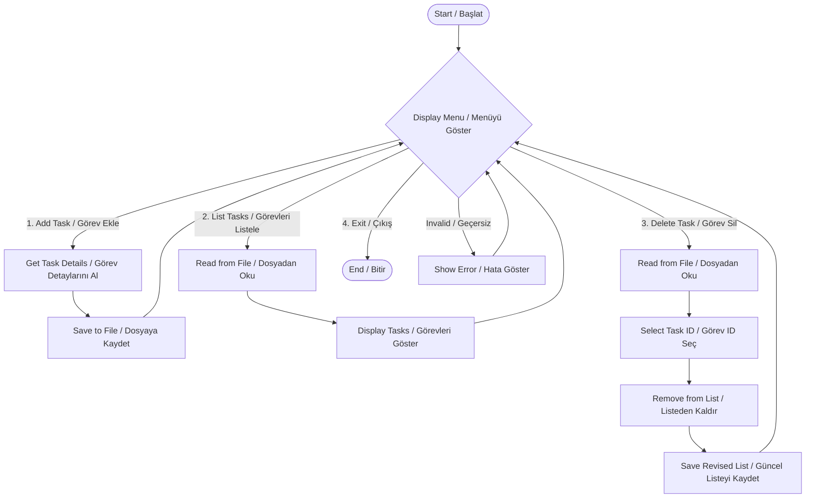

# Algorithm & Flowchart / Algoritma ve Akış Şeması

This document outlines the logical flow of the To-Do List application.
Bu belge, Yapılacaklar Listesi uygulamasının mantıksal akışını ana hatlarıyla belirtir.

## Flowchart / Akış Şeması

## Algorithm Steps / Algoritma Adımları

1.  **Start Program**: Initialize variables and check for existing data file.

    - **Programı Başlat**: Değişkenleri başlat ve mevcut veri dosyasını kontrol et.

2.  **Main Loop**: Display the menu options to the user.

    - **Ana Döngü**: Kullanıcıya menü seçeneklerini (Ekle, Listele, Sil, Çıkış) göster.

3.  **User Input**: Get the user's choice.

    - **Kullanıcı Girişi**: Kullanıcının seçimini al.

4.  **Add Task**:

    - Ask for task description and priority.
    - Append the new task to the data structure and save to file.
    - **Görev Ekle**:
    - Görev açıklamasını ve önceliğini iste.
    - Yeni görevi veri yapısına ekle ve dosyaya kaydet.

5.  **List Tasks**:

    - Read tasks from the file.
    - Print task ID, description, and status to the screen.
    - **Görevleri Listele**:
    - Görevleri dosyadan oku.
    - Görev ID, açıklama ve durumunu ekrana yazdır.

6.  **Delete Task**:

    - List current tasks.
    - Ask the user for the ID of the task to delete.
    - Remove the task and rewrite the file.
    - **Görev Sil**:
    - Mevcut görevleri listele.
    - Kullanıcıdan silinecek görevin ID'sini iste.
    - Görevi kaldır ve dosyayı yeniden yaz.

7.  **Exit**: Terminate the program.
    - **Çıkış**: Programı sonlandır.
